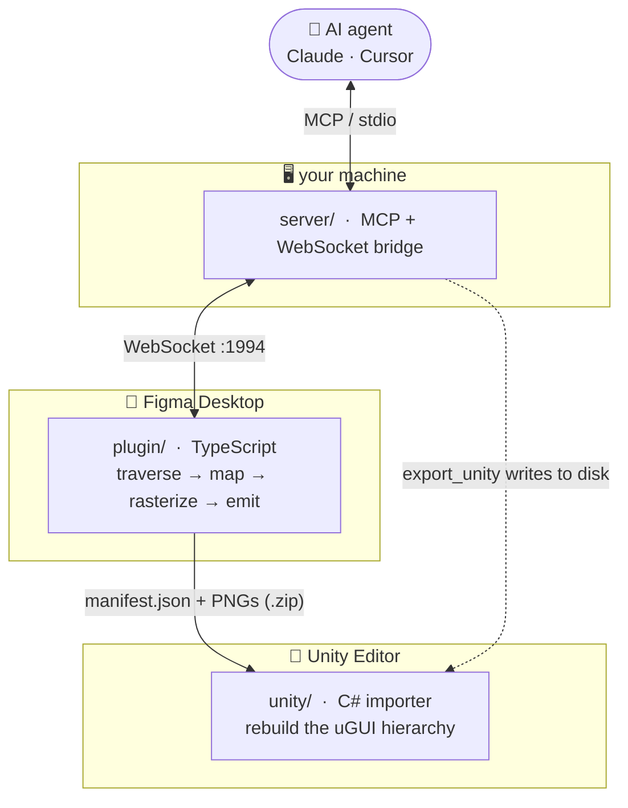

<div align="center">

# ◆ &nbsp;F I G F O R G E

### Draw it in Figma. Forge it into Unity uGUI — by hand-off or by AI.

<br/>

[](https://github.com/havokentity/FigForge/releases/latest)
[](https://github.com/havokentity/FigForge/actions/workflows/ci.yml)
[](https://github.com/havokentity/FigForge/commits/main)
[](LICENSE)


**[Use it](#-if-you-just-want-to-use-it)** · **[How it works](#-what-happens-to-a-frame)** · **[Install](#-setting-it-up-properly)** · **[Canonical UI](#-the-canonical-trick)** · **[AI bridge](#-handing-the-wheel-to-an-agent)** · **[Troubleshoot](#-when-it-fights-you)**

</div>

---

Most Figma-to-Unity tools hand you a pile of flat images. FigForge keeps the
*structure*: a button stays anchored like a button, a stretched bar stays
stretched, a rounded panel keeps its corners **and** its colour. You export a
frame, and on the Unity side it comes back as a real, responsive uGUI hierarchy
you'd have been happy to build by hand — only you didn't.

It comes in three parts that all speak one file format, so any piece is
swappable and nothing is magic.

> [!TIP]
> ### ⚡ If you just want to use it
> ```text
> 1.  Build/install the Figma plugin   →   open it in Figma Desktop
> 2.  Select a frame  →  Export for Unity   →   a .zip drops
> 3.  Window ▸ FigForge ▸ Importer  →  Import a .zip…  →  Build
> ```
> That's the whole loop. The AI bridge is optional sugar for when you want an
> agent to skip the zip and write straight into your project.

---

## ⬡ The three parts, and the one file

FigForge is deliberately not a monolith:



| Part | Stack | Job |
|:--|:--|:--|
| **`plugin/`** | TypeScript · esbuild | Read the frame, turn constraints into anchors, decide pixels-vs-structure, emit the manifest + assets. |
| **`server/`** | TypeScript · MCP · WebSocket | Let an agent read the file and `export_unity` to disk. Leader/follower election shares one plugin socket across clients. |
| **`unity/`** | C# · Editor + Runtime | Rebuild the anchored hierarchy from the manifest + sprites. |

The glue is **the manifest** — one JSON contract the plugin writes and the
importer reads. Change one side, change the other. Everything else is detail.

---

## ✦ What it actually gets right

| In Figma | …becomes in Unity |
|:--|:--|
| 📐 Layout constraints (stretch / pin / centre / scale) | real `RectTransform` anchors, **per axis** — responsive, not centred-and-fixed |
| 🎨 Solid fill | `Image` tint (rounded → procedural 9-sliced sprite) |
| 🌈 Gradient fill | baked gradient sprite — not flattened to one colour |
| ▭ Stroke (width + colour) | 9-sliced outline, rounded-corner aware |
| ↻ Rotation | preserved on the `RectTransform` |
| ✎ Vector / icon | rasterized PNG, hash-deduped |
| 🅣 Text | `TextMeshProUGUI` + per-family/style font mapping |
| 🔘 `Btn_<name>_<Ref>` / `Inp_<name>_<Ref>` layer | a real **canonical prefab** instance |
| 🗂 Several frames | one navigable scene — `FigForgeScreen` frames under a `UIFrameManager` |
| 👻 Empty/placeholder paint, failed export | falls back to the fill colour — **no junk PNG, no white box** |

Plus, in the plugin itself: exclude layers, merge a container to one PNG,
force-rasterize text, search the tree, and live-preview any node.

> [!TIP]
> **Two Unity backends.** The importer can build classic **uGUI** (GameObjects +
> `RectTransform`/`Image`/TMP) *or* **UI Toolkit** — a generated `.uxml` + `.uss`
> (absolute/stretch layout, native borders & rounded corners, baked gradients,
> image backgrounds, canonical controls, optional in-scene
> `UIDocument`). Flip it with the **UI backend** dropdown.

---

## ✦ What happens to a frame

Follow a single frame through the machine; every capability shows up along the way.

> **0 · You curate it.** Exclude layers, merge a container into one flat PNG,
> force a text layer to rasterize, search, and preview any node before committing.
>
> **1 · It gets walked.** A depth-first pass classifies every node. Placeholder
> and fully-transparent paints are recognised as *nothing* — so they never bake
> out as junk PNGs or stray white boxes.
>
> **2 · Layout becomes anchors.** Each layer's Figma constraints map to real
> Unity anchors — stretch, pin, centre, or proportional, per axis. Rotation rides along.
>
> **3 · Pixels vs. structure gets decided.** Vectors and icon groups rasterize
> (deduped). Solid *and gradient* fills are captured as data; strokes carry width
> and colour; rounded fill-only panels become procedural rounded sprites; text
> stays `TextMeshProUGUI`. A failed export falls back to its fill colour.
>
> **4 · It's written out.** `manifest.json` + PNGs — a downloadable zip, or, over
> the bridge, straight into your Unity project.
>
> **5 · Unity rebuilds it.** Anchored hierarchy under a `Canvas`, fonts mapped to
> `TMP_FontAsset`s, canonical layers swapped for prefab instances, and each frame
> shown by a `UIFrameManager` as one `FigForgeScreen` — many frames → one
> navigable, multi-page scene.

---

## ✦ Setting it up properly

> [!NOTE]
> Prefer not to build anything? Every piece ships prebuilt on the
> **[latest release](../../releases/latest)**.

<details open>
<summary><b>① &nbsp;The Figma plugin</b></summary>

```bash
cd plugin && npm install && npm run build      # → dist/main.js + dist/ui.html
```

Then in Figma **Desktop** (it needs `exportAsync`, which the browser lacks):
*Plugins → Development → Import plugin from manifest…* → `plugin/manifest.json`.
From a release instead: unzip `figforge-plugin-<ver>.zip` and import its `manifest.json`.
</details>

<details>
<summary><b>② &nbsp;The bridge server</b> &nbsp;<i>(only for the AI workflow)</i></summary>

```bash
cd server && npm install && npm run build      # → dist/index.js
```

Point your MCP client at it. Set `FIGFORGE_WORKSPACE` to your Unity project root
so `export_unity` writes there (and refuses to write anywhere else):

```jsonc
{
  "mcpServers": {
    "figforge": {
      "command": "node",
      "args": ["<abs>/server/dist/index.js"],
      "env": { "FIGFORGE_WORKSPACE": "<abs>/MyUnityProject" }
    }
  }
}
```

From a release instead: unzip `figforge-bridge-<ver>.zip`, then `npm install --omit=dev`.
</details>

<details>
<summary><b>③ &nbsp;The Unity importer</b></summary>

```text
Package Manager ▸ Add package from git URL…
    https://github.com/havokentity/FigForge.git?path=unity#v1.0.57
Package Manager ▸ Add package from tarball…
    figforge-unity-importer-<ver>.tgz   (from a release)
Package Manager ▸ Add package from disk…
    unity/package.json
```

Pin the git URL to a tag (`#v1.0.57`) so upgrades stay deliberate. Deps — uGUI,
TextMeshPro, Newtonsoft JSON, 2D Sprite, Input System — resolve automatically.
</details>

> [!IMPORTANT]
> Install the importer from a tag that ships `.meta` files (`v1.0.1`+). Unity
> ignores meta-less assets inside immutable package folders, so an earlier build
> would silently produce no `FigForge` assembly.

---

## ✦ The canonical trick

The part that makes FigForge more than an importer. Name a Figma layer like this:

```text
Btn_<instanceName>_<canonicalRef>          Btn_Save_PrimaryButton
Inp_<instanceName>_<canonicalRef>          Inp_Email_InputField
└┬┘ └─────┬──────┘ └──────┬──────┘
 │        │               └─ which reusable definition to drop in
 │        └─ this instance's own name
 └─ the kind tag (button, for now)
```

On import, instead of rebuilding that layer from a flattened PNG, FigForge looks
up `PrimaryButton` in a **Canonical Library** asset you provide
(*Create ▸ FigForge ▸ Canonical Library*), instantiates your real button prefab,
and stamps the label onto it. Define a control once; reference it by name from
every screen; restyle the prefab and every page updates. Miss a mapping and you
get a labelled placeholder plus a warning — never a broken build.
Full walkthrough → [`docs/canonical-elements.md`](docs/canonical-elements.md).

---

## ✦ Handing the wheel to an agent

With the bridge running, an MCP client can drive the whole thing:

| Tool | Does |
|:--|:--|
| `get_metadata` | file name, pages, current page |
| `get_document` / `get_selection` / `get_node` / `get_node_details` | read the tree, the selection, or one node (deep) |
| `get_design_context` | a layout-aware, summarized design tree |
| `list_frames` / `list_screens` | enumerate top-level frames / export-eligible screens |
| `get_screenshot` / `save_screenshots` | render node(s) to PNG (returned base64, or written to disk) |
| `create_canonical` / `create_shell` | scaffold a canonical control / app-shell frame in the document |
| **`export_unity`** | run the real exporter and write `manifest.json` + PNGs to a folder |
| **`export_project_unity`** | export the page as a connected multi-page project bundle |
| `validate_manifest_contract` | check a manifest/project JSON against the importer contract |

`export_unity` is sandboxed to the workspace root. The plugin's header **MCP
toggle** dials out to `ws://127.0.0.1:1994/ws` (and auto-reconnects while on);
the leader/follower design lives in [`docs/architecture.md`](docs/architecture.md).

> [!NOTE]
> The plugin is the WebSocket **client** — it can't *be* the server (Figma's
> sandbox forbids it). Run `server/` separately; that process is the bridge.

---

## ✦ The manifest, in one breath

One JSON file describes the screen, every element (rect, computed Unity
transform, components, style, text, any sprite or canonical reference, children),
the asset list, and the fonts used. The plugin writes it; the C# `ManifestData`
mirrors it field-for-field. Full schema → [`docs/plugin-guide.md`](docs/plugin-guide.md).

---

## ✦ When it fights you

| Symptom | Fix |
|:--|:--|
| Plugin says *"Select a frame…"* | Select a Frame, Component, or Group — not a lone shape. |
| Export button greyed out | Nothing valid is selected. |
| Bridge dot stays red | Server isn't up, or port `1994` is taken — start it and hit **Connect**. |
| Wrong fonts in Unity | Map each `family\|style` to a `TMP_FontAsset` in the importer's Fonts section. Inter is bundled and auto-generates TMP assets when a project is missing them. |
| Canonical layer came in as a purple placeholder | Assign a Canonical Library and map that ref to a prefab, then rebuild. |
| Sharp/white box where a panel should be rounded | Give the layer a real fill or stroke; fill-only rounded panels are drawn procedurally. |
| `using FigForge` won't resolve after a git install | Use a tag that ships `.meta` files (`v1.0.1`+). |

---

## ✦ On the bench (not built yet)

A 2D `SpriteRenderer` output mode · dashed-stroke fidelity · richer canonical
control behaviours. PRs welcome.

---

## ✦ Where things live

```text
plugin/   Figma plugin          — TypeScript / esbuild
server/   MCP bridge            — TypeScript
unity/    Unity importer (UPM)  — C#, Editor + Runtime
docs/     Guides                — incl. how releases are cut: docs/releasing.md
```

Releases are cut from `vX.Y.Z` tags by CI → [`docs/releasing.md`](docs/releasing.md).

<div align="center">

<br/>

**Needs** &nbsp; Unity 2022.3+ (tested through 6000.x) · Node ≥ 22.6 · TextMeshPro · Newtonsoft JSON &nbsp;&nbsp;•&nbsp;&nbsp; **MIT** licensed

</div>
