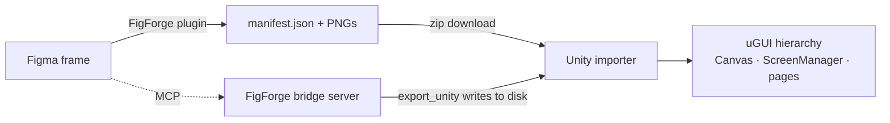

<div align="center">

# ◆ FigForge

**Forge Figma frames into Unity uGUI — with an AI bridge.**

A Figma plugin, an MCP bridge server, and a Unity importer that together turn a
selected frame into a clean, anchored uGUI hierarchy: sprites, gradients,
strokes, rotation, text, **canonical UI elements**, and **connected multi-page
scenes**.


</div>

---

## Contents

- [Why FigForge](#why-figforge)
- [How it works](#how-it-works)
- [Features](#features)
- [Quick start](#quick-start)
- [Canonical UI elements](#canonical-ui-elements)
- [The MCP bridge](#the-mcp-bridge)
- [Manifest format](#manifest-format)
- [Troubleshooting](#troubleshooting)
- [Repo layout](#repo-layout)

## Why FigForge

Hand-rebuilding Figma screens in Unity is slow and drifts from the design.
FigForge exports the structure (layout, text, styles) **and** the pixels (PNGs),
then rebuilds a faithful, *responsive* uGUI hierarchy — honouring each layer's
Figma constraints instead of dumping everything into centered, fixed rects.

It also ships an **MCP bridge** so an AI agent (Claude, Cursor, …) can read your
Figma file and export frames straight into your Unity project, no manual zip
shuffling.

## How it works



Three pieces, one manifest contract:

| Piece | Tech | Role |
|------|------|------|
| **Plugin** (`plugin/`) | TypeScript + esbuild | Traverse the frame, map constraints → anchors, rasterize what must be pixels, emit `manifest.json` + PNGs. |
| **Bridge** (`server/`) | TypeScript (MCP, WebSocket) | Expose the file + an `export_unity` tool to AI agents. Leader/follower election shares one plugin connection across clients. |
| **Importer** (`unity/`) | C# (Unity Editor) | Rebuild the uGUI hierarchy from the manifest + sprites. |

## Features

- **Constraint-driven anchors** — stretch / pin / center / proportional, per axis, straight from Figma constraints.
- **Solid + gradient fills** — gradients are baked to sprites, not flattened to a single colour.
- **Real stroke borders** — width + colour carried through and rendered as 9-sliced outlines (rounded aware).
- **Rotation** preserved on the `RectTransform`.
- **Rounded fill-only panels** render as procedural 9-sliced rounded rects — no white/sharp boxes.
- **Robust rasterization** — empty/placeholder paints and failed exports fall back to the element's fill instead of baking junk PNGs.
- **Text** as `TextMeshProUGUI` with per-family/style font mapping.
- **Canonical UI elements** — reference a reusable prefab by name (`Btn_<instance>_<ref>`). See below.
- **Connected multi-page scenes** — every imported frame is a `BaseScreen` under one `Canvas` + `ScreenManager`.
- **AI bridge** — MCP tools to read the design and export to disk.
- **Per-element control** in the plugin: exclude, merge-to-one-PNG, force-rasterize, live preview, search.

## Quick start

> **Fastest path:** grab prebuilt artifacts from the [latest release](../../releases/latest)
> — no `npm` build required. Or build from source with the steps below.

### 1. Plugin

- **From a release:** download `figforge-plugin-<ver>.zip`, unzip it, then in
  Figma Desktop: **Plugins → Development → Import plugin from manifest…** → `manifest.json`.
- **From source:**
  ```bash
  cd plugin && npm install && npm run build   # → dist/main.js + dist/ui.html
  ```
  then import `plugin/manifest.json` the same way.

### 2. Bridge server (optional, for AI workflows)

- **From a release:** download `figforge-bridge-<ver>.zip`, unzip, `npm install --omit=dev`.
- **From source:** `cd server && npm install && npm run build`.

Register it with your MCP client (run it from your Unity project root so
`export_unity` writes there):

```jsonc
{
  "mcpServers": {
    "figforge": { "command": "node", "args": ["<abs>/server/dist/index.js"] }
  }
}
```

### 3. Unity importer

- **Git URL:** Package Manager → **Add package from git URL…** →
  `https://github.com/<owner>/<repo>.git?path=unity`
- **Tarball:** Package Manager → **Add package from tarball…** →
  `figforge-unity-importer-<ver>.tgz` from a release.
- **From disk:** **Add package from disk…** → `unity/package.json`.

### 4. Export & build

1. Select a frame in Figma, open **FigForge**, tweak per-element options, **Export for Unity** → a zip downloads.
2. Unzip anywhere under `Assets/`.
3. **Window ▸ FigForge ▸ Importer** → pick the manifest → **Build**.

## Canonical UI elements

Define a control once, reference it everywhere. Name a Figma layer:

```
Btn_<instanceName>_<canonicalRef>
   e.g.  Btn_Save_PrimaryButton
```

- `Btn` → kind (button — the only kind today).
- `Save` → this instance's name.
- `PrimaryButton` → the canonical definition to use.

In Unity, create a **Canonical Library** (Create ▸ FigForge ▸ Canonical Library),
map `PrimaryButton` → your button prefab, and assign it in the importer. FigForge
instantiates the prefab (and stamps its label) instead of rebuilding the layer
from a PNG. Full guide: [`docs/canonical-elements.md`](docs/canonical-elements.md).

## The MCP bridge

Tools exposed to agents: `get_metadata`, `get_document`, `get_selection`,
`get_node`, `get_design_context`, `get_screenshot`, `save_screenshots`, and
`export_unity` (writes `manifest.json` + PNGs to a folder, validated to stay
inside the server's working directory). The plugin's **Bridge** tab connects to
`ws://127.0.0.1:1994/ws`. More: [`docs/architecture.md`](docs/architecture.md).

## Manifest format

A single JSON contract shared by the plugin (emitter) and the importer
(consumer). It carries the screen, every element (rect, Unity transform,
components, style, text, asset ref, canonical ref, children), the asset list,
and the font inventory. Field reference: [`docs/plugin-guide.md`](docs/plugin-guide.md).

## Troubleshooting

| Symptom | Fix |
|--------|-----|
| Plugin shows "Select a frame…" | Select a Frame, Component, or Group (not a single shape). |
| Export button disabled | Nothing valid is selected — pick a frame. |
| Bridge dot stays red | Start the server and click **Connect** on the Bridge tab; check port 1994 isn't taken. |
| Fonts look wrong in Unity | Map each `family|style` to a `TMP_FontAsset` in the importer's Fonts section. |
| Canonical layer became a purple placeholder | Assign a Canonical Library and map the ref name to a prefab, then rebuild. |
| White/sharp box where a panel should be rounded | Ensure the layer has a real fill or stroke; FigForge renders rounded fill-only panels procedurally. |

## Repo layout

```
plugin/   Figma plugin (TypeScript, esbuild)
server/   MCP bridge server (TypeScript)
unity/    Unity importer package (C#: Editor + Runtime)
docs/     Guides
```

> **Roadmap:** 2D `SpriteRenderer` output mode, dashed-stroke fidelity, and more
> canonical kinds (inputs, toggles). Contributions welcome.

MIT licensed.
