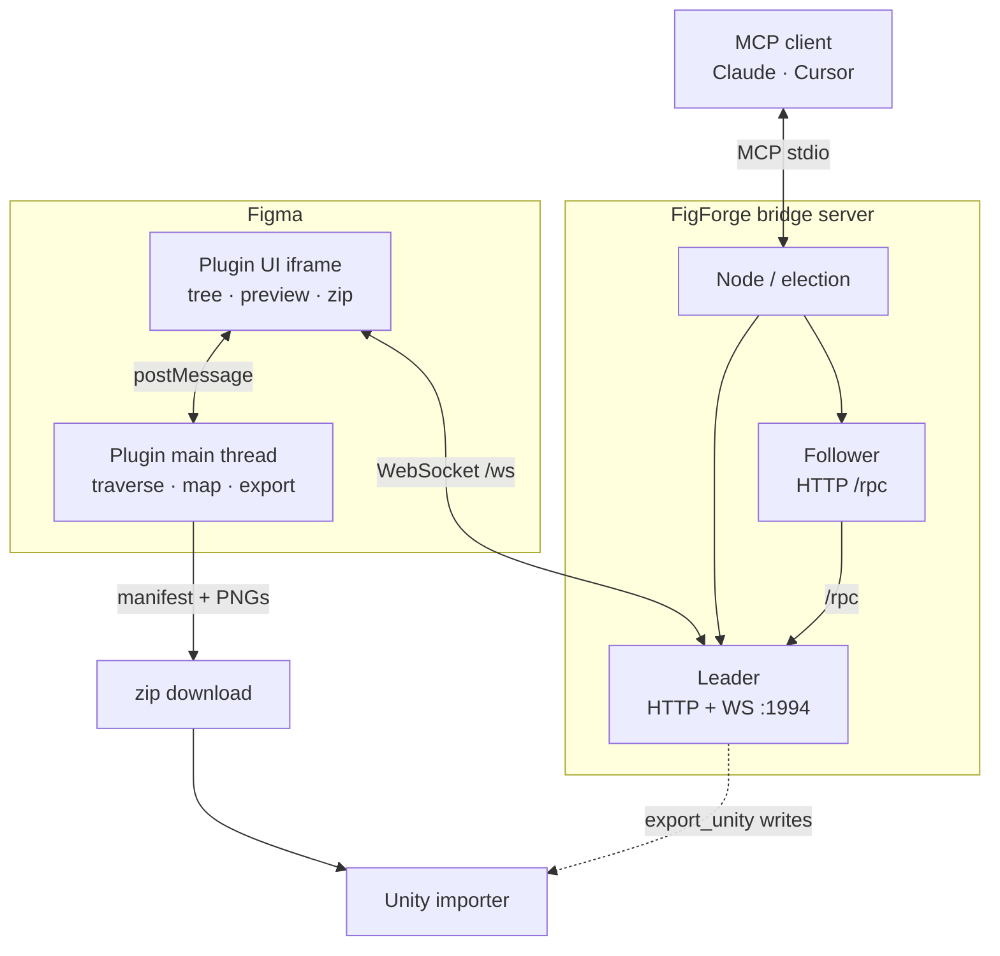

# Architecture

## Plugin (`plugin/`)

- `traverser.ts` — DFS, exportability rules, `isEmptyPaint` (the core
  "no junk PNG / no white box" guard).
- `mapper.ts` — Figma constraints + rect → Unity anchors. Emits `offsetMin`/
  `offsetMax` so any anchor config (stretched or fixed) is expressed uniformly.
- `exporter.ts` — builds the manifest, extracts fills/strokes/text/canonical,
  rasterizes exportable nodes (hash-deduped), with failed-export → fill fallback.
- `main.ts` — document owner; runs exports; serves MCP commands forwarded by the UI.
- `ui.ts` / `ui.html` — the panel; packages the zip with JSZip; hosts the bridge WebSocket client.

## Bridge (`server/`)

A stdio **MCP server**. Each MCP client spawns its own process, but only one
WebSocket to the single Figma plugin can exist — so processes elect a **leader**
(binds `127.0.0.1:1994`, owns `/ws` to the plugin and `/rpc` for peers) while the
rest are **followers** proxying over `/rpc`. If the leader dies, a follower's next
call triggers a takeover.

- `bridge.ts` — request/response correlation over the plugin socket (per-tool timeout: 30s for queries, minutes for exports).
- `leader.ts` / `follower.ts` / `election.ts` — the role machinery.
- `tools.ts` / `schema.ts` — MCP tool definitions (Zod-validated). `export_unity`
  and `save_screenshots` validate that output paths stay within the workspace root
  (`FIGFORGE_WORKSPACE`, defaulting to the launch cwd).

## Importer (`unity/`)

- **Editor** — `FigForgeImporterWindow` (UI), `ManifestParser`, `TextureImportHelper`,
  `SpriteAtlasHelper`, `HierarchyBuilder`, procedural sprite caches.
- **Runtime** — `FrameManager`, `FigForgeScreen`, `CanonicalLibrary` (so built scenes
  and prefabs work at runtime without the editor assembly).

## The contract

`plugin/src/types.ts` (`Manifest`) and `unity/Editor/Data/ManifestData.cs` are the
same shape. Change one, change the other.
